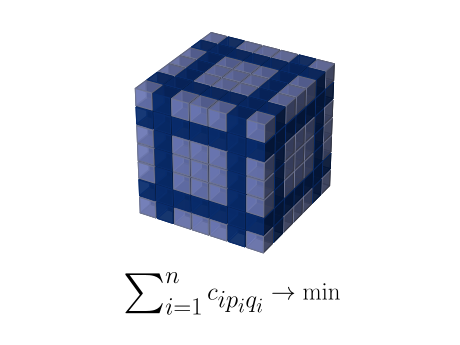
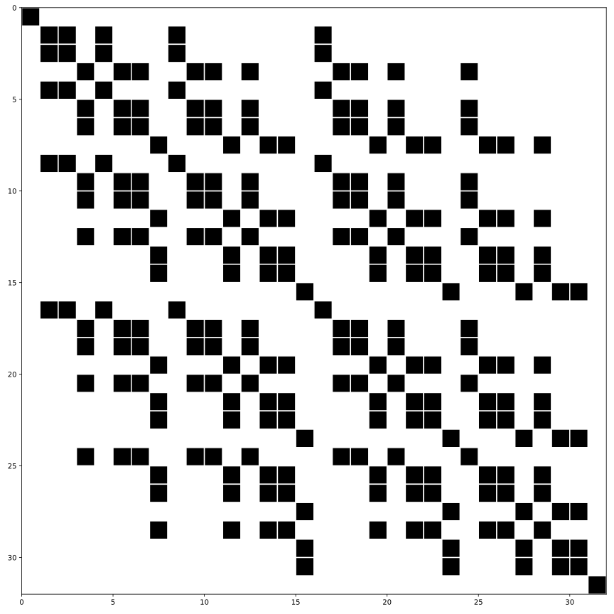

# About
DP on masks or subset DP is a technique to decrease complexity of algorithms with permutational structure.

### More programming details:
1. In every solution, I prefer to iterate k-subsets in following pattern:
```cpp
for (int k = 0; k <= n; ++k) {
    for (int mask = (1<<k)-1; mask < (1<<n); mask = next_comb(mask)) {
        // do something
    }
}
```
This code traverse subsets in order of their sizes and have asymptotics $O(2^n)$.

2. Here next\_comb() is a following bit trick
```cpp
inline int next_comb(int v) {
    int t = v | (v - 1);
    return (t + 1) | (((~t & -~t) - 1) >> (__builtin_ctz(v) + 1));
}
```
For practical reasons, one can prefer any convenient way to iterate over k-subsets.
The main thing is to follow the order from subsets of size k to k+1.

3. When I need to iterate bits in mask I can use this code snippet:
```cpp
for(int y = mask, j = 0; (j = __builtin_ctz(y)) < n; y ^= 1<<j) {
   // do something with bit number j in mask
}
```
This is somewhat faster than to check every bit.

### Problem list
Here you can find my collection of nice example tasks. 

### **tsp**:
> Given distances between cities find closed tour through all of them with minimal length.

This is classic NP-hard problem and its DP solution is based on masks.

```
Store one array: dp[n][2^n], minimum path through vertices in mask from k to 0 vertice

for k in 1..n
    for mask in combinations(k)
        for i in 1..n
            choose bit j in mask
                update dp: dp[i][mask] = min(dp[i][mask], dp[j][mask ^ (1>>j)] + a[j][i])
```

Tested (_tsp.cpp_):
```
n/T O(n!) O(n^2 2^n)
12   7s   1ms
20   >>   0.25s
25   >>   14s 
```

Solution complexity: $O(n^2 \cdot 2^n)$ time, $O(n \cdot 2^n)$ space.

### **min_sum**:

> Given $n$ x $n$ chess board with $n^2$ integer numbers. 
Place $n$ rooks so they don't attack each other and sum of their positions would be minimal.

Actually it can be solved in polynomial time by one of the matching algorithms. 
It is surprizing because **min_sum** and **tsp** look so similar (given some matrix, need to find certain permutation of indexes).

Anyway, my first DP solution attempt was the following (min\_sum\_2d\_dp()):

```
Store two arrays: dp[2^n], chosen[2^n]

for k in 1..n
    for mask in combinations(k)
        choose index i not in mask (mask & (1<<i) is zero)
            choose minimum a[i][j] among columns not chosen (chosen[mask])
               update (dp, chosen) when necessary
```

Solution complexity: $O(n^2 \cdot 2^n)$ time, $O(2^n)$ space.

The second attempt appeared when I realized how to get rid of _chosen[]_ array,
actually we can fix the order of optimization, so let _dp[mask]_ be the answer for first _k_ rows, where _k_ is number of bits in mask.
```
Store one array: dp[2^n]

for k in 1..n
    for mask in combinations(k)
        choose bit i in mask
            update dp: dp[mask] = min(dp[mask], dp[mask ^ (1>>i)] + a[k][i])
```
Solution complexity is better: $O(n \cdot 2^n)$ time, $O(2^n)$ space.

Tested (_min\_sum.cpp_):
```
n/T O(n!) O(n^2 2^n) O(n 2^n) 
12   3s   0.6ms      0.5ms
20   >>   0.3s       40ms
30   >>   500s       61s
```

_Update 28/03/25:_ Restore answer from dp table for second version. 
Polynomial algorithm for _min\_sum_ (based on minimum cost maximum flow). Computed answer for _n=1000_ in 5s on my laptop.

### **min_sum_3d**:
> Given cube array $c_{ijk}$ of $n^3$ elements, choose $n$ elements each from distinct (xy, yz, xz)-planes so their sum would be minimal.



This problem is really great and appeared on ICPC 2024. It can be viewed as 3d version of min\_sum, however there is no
polynomial solution here, at least as I can imagine.

```
Store array: dp[2^n][2^n], 
dp[mask_x][mask_y] means optimal choice in c[1...k] where k = size of masks
when size(mask_x) != size(mask_y) dp state is infeasible

for k in 1..n
    for mask_y in combinations(k)     # C_{n}^{k}
        for mask_z in combinations(k) # ...
            for y in mask_y:          # O(k^2) or O(n^2)
                for z in mask_z:
                    update dp: dp[mask_y][mask_z] = min(dp[mask_y][mask_z], dp[mask_y ^ 1>>y][mask_z ^ 1>>z] + c[k][y][z])
```

Solution complexity: depending on the code it can be
$O(\sum_{k=1}^n (n C_{n}^{k})^2)$ or $O(\sum_{k=1}^n (k C_{n}^{k})^2)$.
The first one is $n^2 \cdot ( C_{2n}^{n}-1)$ and it can be proved that second one is $n^2 \cdot C_{2n-2}^{n-1}$.
Both behave like central binomial $\sim 2^{2n}/\sqrt{n}$ up to $n^2$ term, however second version performs ~3.9 times less operations.

Result: $O(n \sqrt{n} \cdot 2^{2n})$ time, $O(2^{2n})$ space.
For comparison, naive solution runs in $O((n!)^2)$ time.

Tested (_cube.cpp_):
```
n/T O(n!^2) O(n^(3/2) 2^2n)
8    11.3s  0.3ms
12   >>     0.1s
14   >>     2s
```

It is also interesting how memory consumption works for this problem.
Note, that _dp[]_ array is sparse. See example for $n=5$:



In fact, fraction of used array elements decrease as $\sim \frac{1}{\sqrt{\pi n}}$.
